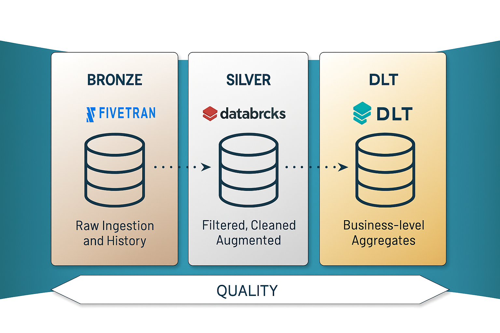
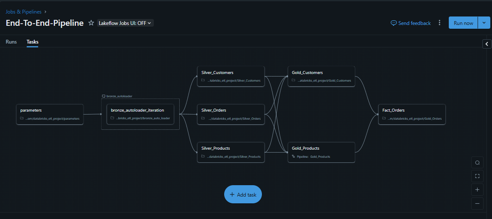
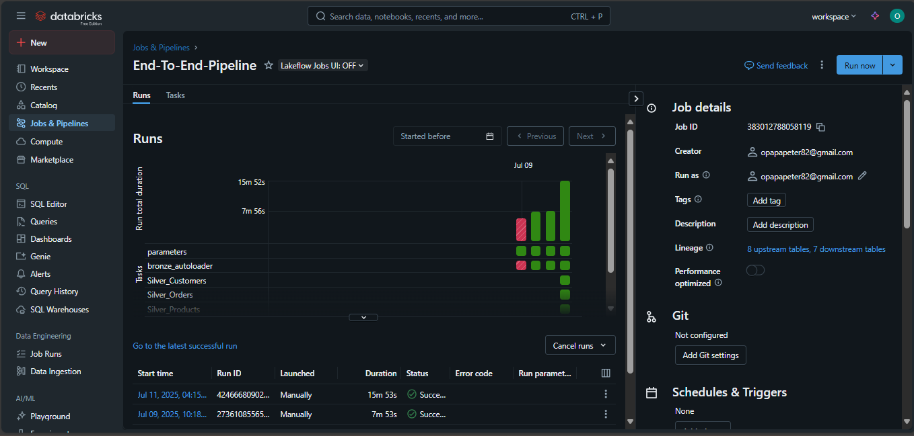
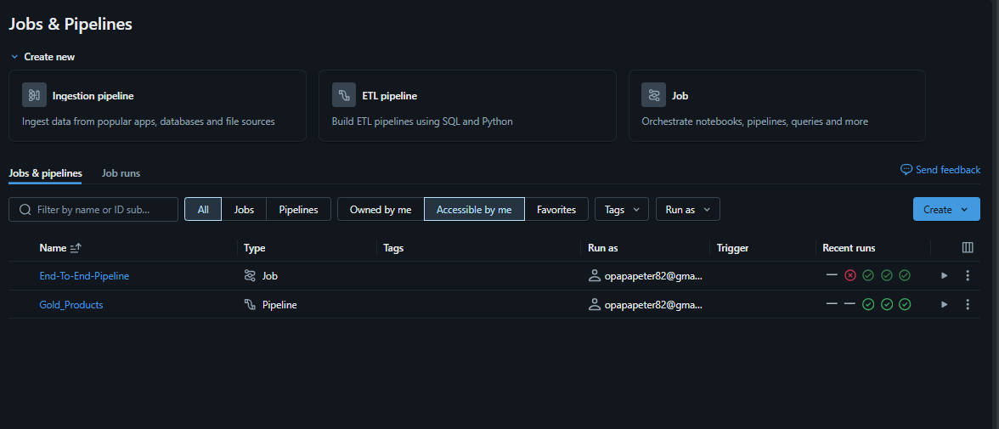
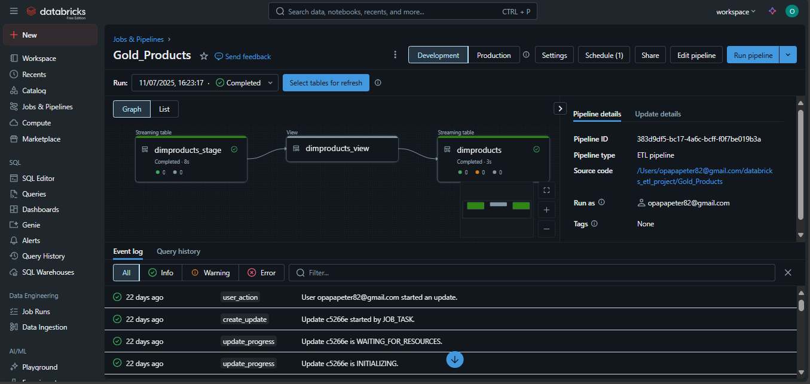
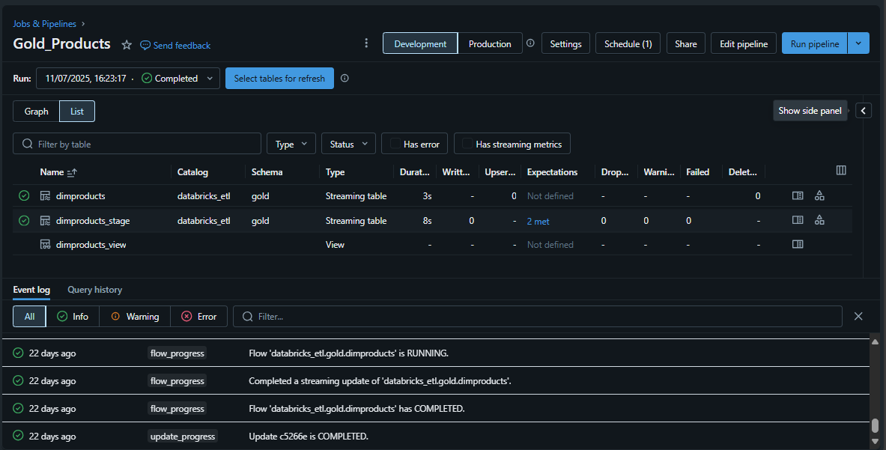

# 🏗️ End-to-End Data Pipeline: Fivetran → Databricks Lakehouse (DLT, CDC, SCD)

This project demonstrates a complete, production-ready **ETL pipeline** that ingests data from **Google Drive via Fivetran**, processes it through the **Medallion Architecture** (Bronze → Silver → Gold) using **PySpark** and **Delta Live Tables**, and applies **CDC** and **SCD** logic to maintain up-to-date business records. The pipeline follows the **Star Schema** modeling technique, utilizes **parameterized notebooks** for dynamic ingestion/transformation, and is orchestrated using **LakeFlow Declrative Pipeline**.

---

## 🧭 Architecture Overview

---

## 🧰 Tools & Technologies

| Tool / Tech                 | Role                                                                 |
|-----------------------------|----------------------------------------------------------------------|
| **Fivetran**                | Automated ELT from Google Drive to Databricks                       |
| **Google Drive**            | Source of raw Excel/CSV files                                       |
| **Databricks Auto Loader**  | Ingest files into Bronze with schema inference                      |
| **PySpark / Spark SQL**     | Data cleansing, enrichment, and transformation in Silver layer      |
| **Delta Live Tables (DLT)** | Declarative pipeline with CDC + SCD support in the Gold layer       |
| **Delta Lake**              | ACID-compliant, scalable lakehouse storage                          |
| **LakeFlow**                | Workflow orchestration and visual pipeline management               |
| **Star Schema**             | Dimensional data modeling for analytics                             |
| **Medallion Architecture**  | Layered data design (Bronze → Silver → Gold)                        |
| **Parameterized Notebooks** | Dynamic and reusable notebooks for data loading & processing        |

---

## 🔄 Data Pipeline Stages

### 1️⃣ Bronze Layer – Raw Ingestion

- Ingest data from **Google Drive** using **Fivetran** connectors.
- Store raw files in **Delta tables** using **Auto Loader**.
- Notebooks are **parameterized** to dynamically load different source tables.

### 2️⃣ Silver Layer – Cleansed Data

- Apply **PySpark** and **SQL** logic to clean, join, filter, and structure the data.
- Star schema design with fact and dimension tables.
- Reuse **parameterized notebooks** to transform data from multiple sources.

### 3️⃣ Gold Layer – Business-ready Analytics

- Apply **CDC/SCD logic** via **Delta Live Tables (DLT)**.
- Implement slowly changing dimensions (SCD Type 1 and 2).
- Use LakeFlow for job orchestration and monitoring.

---

## 🌟 Data Modeling Approach

This pipeline uses the **Star Schema** for organizing transformed data into:
- **Fact Tables**: e.g., sales, transactions, etc.
- **Dimension Tables**: e.g., customers, products, time, region, etc.

Benefits:
- Simplifies BI queries
- Supports OLAP-style analysis
- Works well with tools like Power BI or Tableau

---

## 🗂️ Medallion Architecture Layers

| Layer      | Format      | Description                                        |
|------------|-------------|----------------------------------------------------|
| **Bronze** | Raw Delta   | Unprocessed data directly from Fivetran            |
| **Silver** | Clean Delta | Transformed and joined data (pySpark&SQL)          |
| **Gold**   | Curated Delta| CDC/SCD-applied business-ready analytics layer     |

---
## 🧪 Visuals

### 📌 Pipeline Job Diagrams

### 📌 LakeFlow Declarative Pipeline

---
## 📂 Project Structure
📁 databricks-lakehouse-pipeline/
├── notebooks/
│   ├── Gold_Customers.ipynb
│   ├── Gold_Orders.ipynb
│   ├── Gold_Products.ipynb
|   ├── Silver_Customers.ipynb
|   ├── Silver_Orders.ipynb
|   ├── Silver_Products.ipynb
|   ├── Silver_Region.ipynb
|   ├── bronze_auto_loader.ipynb
|   └── Parameters.ipynb
│       
├── images/
│   ├── architecture.png
│   ├── lakeflow_declarative_pipeline.png
│   ├── pipeline_end_to_end.png
|   ├── end_to_end_pipeline.png
|   ├── lakeflow_job_execution.png
|   └── overview.png
├── requirements.txt
└── README.md

